# PHP OOP Register, Login and Blog !

  ## Hello World in php-app/index.php

  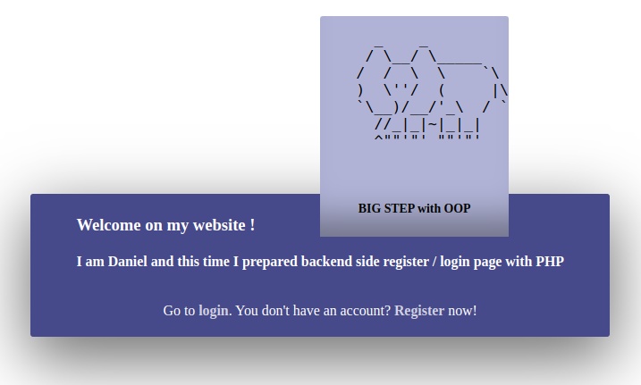

  ## Login and Register panel (php-app/login.php + php-app/register.php)

  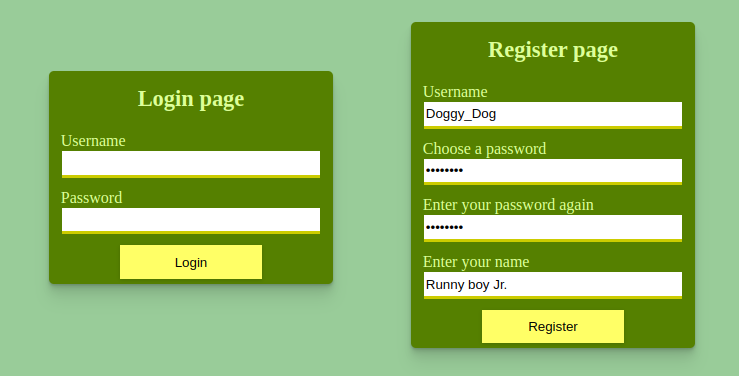

  ## Register panel (php-app/register.php)

  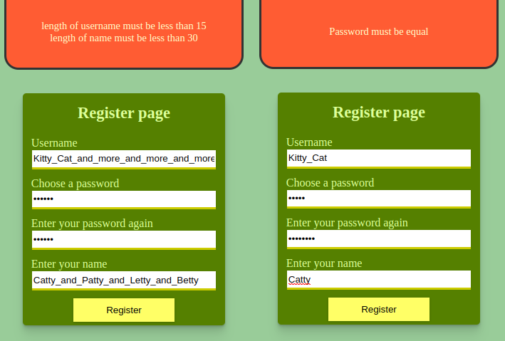

  ## Login panel (php-app/login.php)

  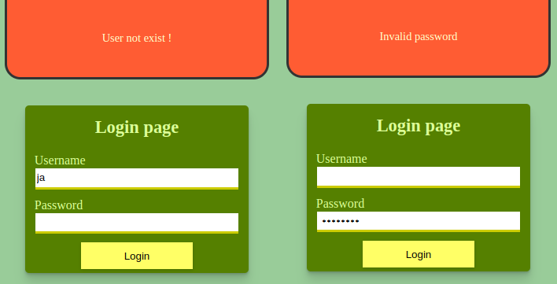

  ## Add cookies after login correct and relocaton to php-app/blog.php

  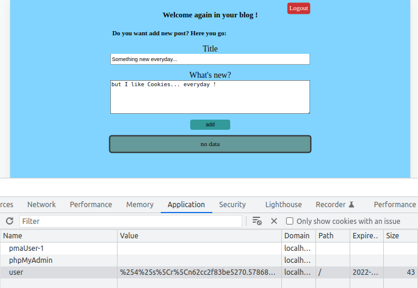

  ## Main content where we can add new post

  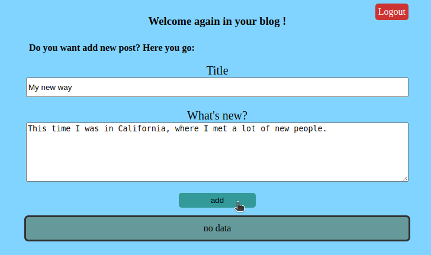

  ## After add new post we can see effect in bottom content

  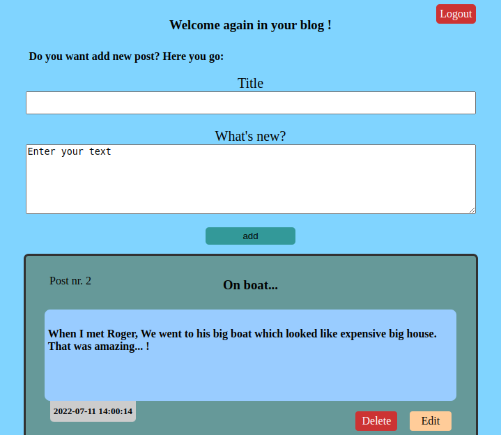

  ## Downstair the posts gathered with edit and delete options

  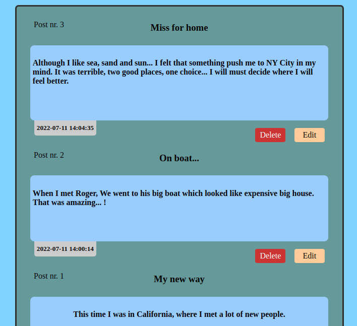

  ## Edit post panel from php-app/blog-update.php

  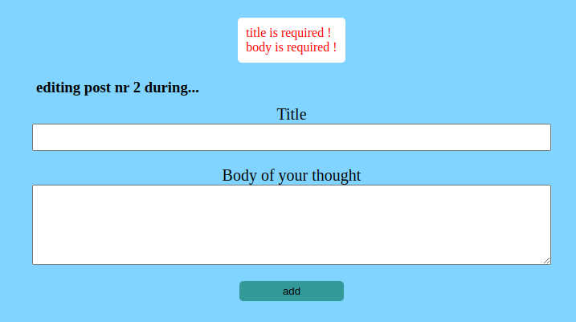

  ## Showing errors after invalid input data

  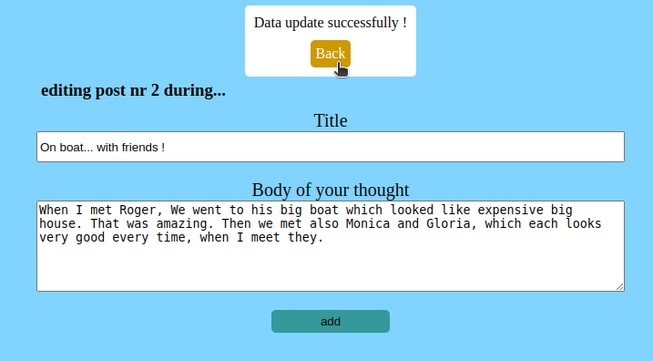

  ## Table structure from database with using phpMyAdmin

  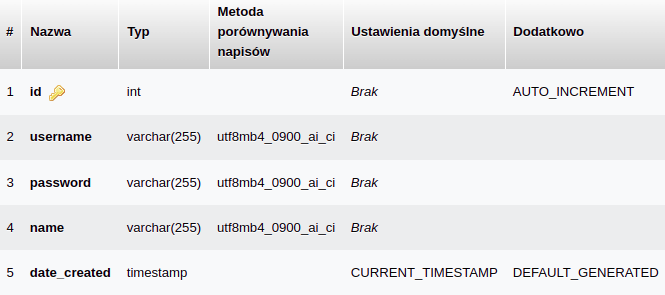

  ## Another structure and relation between tables

  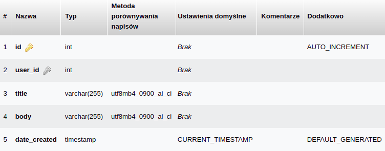

